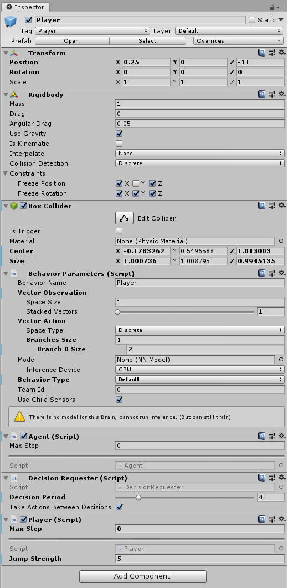

# Machine learning excercise: Jumper

## Inhoudsopgave
- [1. Opdracht](#1-opdracht)
- [2. Het spel](#2-het-spel)
  * [2.1 Environment](#21-environment)
  * [2.2 Platform](#22-platform)
  * [2.3 Player](#23-player)
    + [2.3.1 Components](#231-components)
    + [2.3.2 Eyes](#232-eyes)
  * [2.4 Obstakels](#24-obstakels)
    + [2.4.1 Vijandig obstakel](#241-vijandig-obstakel)
    + [2.4.2 Bonus obstakel](#242-bonus-obstakel)
  * [2.6 Finishline](#26-finishline)
  * [2.7 Spawn](#27-spawn)
  * [2.8 Scoreboard](#28-scoreboard)
- [3. Configuratie](#3-configuratie)
- [4. Beloningen](#4-beloningen)

### 1. Opdracht
De opdracht is om een zelflerende player te maken aan de hand van ML-Agents. Door bepaalde acties uit te voeren, krijgt hij min- en bonuspunten. Hieruit leert hij wat hij wel en niet moet doen. 

De player moet obstakels ontwijken die op hem afkomen door te springen. Als hij geraakt wordt, krijgt hij minpunten en zal hij opnieuw moeten beginnen, en als hij erover springt, krijgt hij pluspunten. Als laatste zijn er ook nog bonus obstakels. Als deze hem raken, krijgt hij in plaats van minpunten, pluspunten. Hiervoor zal hij dus niet moeten springen.


### 2. Het spel
#### 2.1 Environment
Eerst maken we een leeg gameobject aan genaamd environment. Hierin komen al onze objecten te zitten in onze spelomgeving.


Het environment object heeft het onderstaande script. Het script bevat 6 variabelen:
- **Obstacle chance:** kans op 100 dat een vijandig obstakel spawnt, anders spawnt er een bonus obstakel.
- **Obstacle prefab:** De prefab van het obstakel.
- **Bonus obstacle prefab:** De prefab van het bonus obstakel.
- **Player prefab:** De prefab van de player.
- **Interval:** De tijd tussen obstakels die spawnen.


Het environment script is verantwoordelijk voor het spel te beheren. Het script bevat dan ook een aantal methoden om dit te doen.

Eerst hebben we de `SpawnObstacle()` methode. Deze methode zorgt voor het inspawnen van een obstakel. De methode bestaat uit een if-else structuur waar gekeken wordt of het random getal kleiner of gelijk is dan de `obstacleChance` variabele die hierboven werd uitgelegd. Als dit zo is, wordt een vijandig obstakel ingespawnt, anders een bonus obstakel. Als laatste wordt de speed van het obstakel gelijk gezet aan de speed voor de obstakels in die episode.

``` Cs
public void SpawnObstacle()
    {
        Obstacle newObstacle;
        if (random.Next(1, 101) <= obstacleChance)
        {
            newObstacle = Instantiate(obstaclePrefab, spawnPoint.transform);
            newObstacle.transform.SetParent(obstacles.transform);
        }
        else
        {
            newObstacle = Instantiate(bonusObstaclePrefab, spawnPoint.transform);
            newObstacle.transform.SetParent(obstacles.transform);
        }
        newObstacle.speed = episodeObstaclespeed;
    }
```
De tweede methode is de `ClearEnvironment()` methode. Deze wordt na elke episode aangeroepen. Het zorgt ervoor dat elk obstakel in de spelomgeving vernietigd wordt en bepaald de nieuwe snelheid voor de obstakels in de volgende episode.

``` Cs
    public void ClearEnvironment()
    {
        foreach (Transform obstacle in obstacles.transform)
        {
            Destroy(obstacle.gameObject);
        }

        episodeObstaclespeed = Random.Range(obstaclePrefab.minSpeed, obstaclePrefab.maxSpeed);
    }
```
De derde methode is `FixedUpdate()`. Deze bestaat, alweer, uit een if-else structuur. Deze structuur is verantwoordelijk voor het telkens inspawnen van een obstakel na elke interval tijd. Als laatste wordt het scorebord geupdate met de huidige score.

``` Cs
private void FixedUpdate()
    {
        if (currentTime > interval)
        {
            currentTime = 0f;
            SpawnObstacle();
        }
        else
        {
            currentTime += Time.deltaTime;
        }
        scoreBoard.text = "Score: " + player.GetCumulativeReward().ToString("f3");
    }
```

De laatste methode is de `OnEnable()` methode. Hier worden alle componenten geïnstantieerd.

#### 2.2 Platform
De basis van de spelwereld is het platform. Hier zullen de player en de obstakels zich op voortbewegen. Het platform bestaat uit een 3D Plane object die uitgerokken is in de lengte en ingekort in de breedte.


#### 2.3 Player
##### 2.3.1 Components


Het player object is een simpel model, het bestaat uit een lijf met twee ogen en een mond. ...



De player moet enkel kunnen springen, met andere woorden zal hij zich dus enkel moeten kunnen voortbewegen volgens de Y-as. Aan de hand van het `Rigidbody component` zijn er constraints gezet op de andere richtingen(X- en Z-as). Aangezien de player niet moet kunnen ronddraaien is elke rotatie-as vastgezet met de constraints. 

De player beschikt verder nog over drie `ML-Agent component scripts`: **Behavior Parameters script**, **Agent script** en **Decision Requester script**. We hebben een aantal variabelen van het `Behavior Parameters script` aangepast: **Behavior name** veranderd naar `Player` en **Branch 0 size** naar `2`. Als u het Behavior Type op `Heuristic only` zet kan je manueel gaan testen. Indien u dit op default zet, zal u gebruik maken van de ML Agents en kan de agent zichzelf gaan trainen. Als laatste heeft hij ook nog een eigen `Player script`. Dit script bestaat uit een aantal zelfgeimplementeerde methodes.

Deze eerste methode, `JumpPlayer()`, zorgt ervoor dat de player de mogelijkheid heeft om in de lucht te springen. De player kan enkel springen als hij terug op de grond staat. Elke sprong zorgt voor een afstraffing. 

``` Cs
    private void JumpPlayer()
    {
        rigidbody.AddForce(new Vector3(0, jumpStrength, 0), ForceMode.VelocityChange);
        canJump = false;
        AddReward(-0.1f);
    }
```
De volgende methode, `Heuristic()`, roept de `JumpPlayer()` methode aan en zorgt ervoor dat je manueel de player kan laten springen. 

```Cs
public override void Heuristic(float[] actionsOut)
    {
        if (Input.GetKey(KeyCode.Space))
        {
            JumpPlayer();
        }
    }
```

In de methode `OnCollisionEnter()`, worden de collision logica toegepast. Als een vijandig obstakel de player raakt zal dit het obstakel vernietigen, de episode beïndigen en voor een afstraffing zorgen. als de spelen geraakt wordt door een bonus obstakel zal hij beloont worden en zal het obstakel ook weer vernietigd worden. In deze methode wordt er ook voor gezorgd dat de player weet wanneer hij weer kan springen aan de hand van de `canJump` variabele.

```Cs
private void OnCollisionEnter(Collision collision)
    {
        if (collision.transform.CompareTag("Obstacle"))
        {
            Destroy(collision.gameObject);

            AddReward(-1f);
            EndEpisode();
        }
        else if (collision.transform.CompareTag("BonusObstacle"))
        {
            Destroy(collision.gameObject);

            AddReward(0.1f);
        }
        else if (collision.transform.CompareTag("Platform"))
        {
            canJump = true;
        }
    }
```

De laatste methode, `OnEpisodeBegin()`, zal bij elke nieuwe episode de player zijn velocity terug resetten en het environment leegmaken.
```Cs
public override void OnEpisodeBegin()
    {
        rigidbody.angularVelocity = Vector3.zero;
        rigidbody.velocity = Vector3.zero;

        environment.ClearEnvironment();
    }
```
##### 2.3.2 Eyes
De player heeft twee ogen waarmee hij de obstakels kan waarnemen. Deze ogen hebben beiden een `Ray Perception Sensor Component 3D`. Aan dit component geven we `detectable tags` mee. Hier hebben we dan dus de Obstacle tag meegegeven, nu weet de agent dat hij moet letten op objecten met de Obstacle tag. In de onderstaande foto vindt u de waardes terug die wij gegeven hebben aan de parameters.


#### 2.4 Obstakels
Hierna maken we een empty gameobject genaamd Obstacles. Hier zullen alle ingespawnde obstacles in worden gezet.


##### 2.4.1 Vijandig obstakel
Het vijandig obstakel heeft een tag *Obstacle*. Ook heeft het een box collider, rigidbody en een obstacle script. Het obstacle script heeft 3 variabelen:
- **Speed:** dit is de standaard speed van een obstakel.
- **Min speed:** dit is de minimale speed dat een obstakel kan hebben.
- **Max speed:** dit is de maximale speed dat een obstakel kan hebben.


Het obstacle script is verantwoordelijk om de obstakels te laten bewegen. 

De eerste method `MoveObstacle()` is verantwoordelijk voor het vooruitbewegen van het obstakel.

``` Cs
private void MoveObstacle()
    {
        if (environment == null)
        {
            environment = GetComponentInParent<Environment>();
        }
        Debug.Log(speed);
        transform.Translate(Vector3.forward * speed * Time.deltaTime);
    }
```

De tweede method `OnTriggerEnter()` kijkt of het obstakel met een object met de tag *Finishline* in contact is gekomen. Als dit zo is, krijgt de player een reward en wordt het obstakel vernietigd.

``` Cs
private void OnTriggerEnter(Collider other)
    {
        if (other.CompareTag("FinishLine"))
        {
            player.AddReward(0.15f);
            Destroy(gameObject);
        }
    }
```

De overige 2 methodes `Start()` en `Update()` worden gebruikt om player te instantiëren en om de `MoveObstacle()` aan te roepen om het obstakel te laten bewegen.

##### 2.4.2 Bonus obstakel 
De bonus obstakels bestaan uit dezelfde componenten en script als de vijandige obstakels. Het verschil is dat zij de tag *BonusObstacle* hebben.

#### 2.6 Finishline 
De prefab Finishline is, zoals de naam zegt, het einde. Het heeft een tag *FinishLine* en een box collider met *IsTrigger* aangevinkt zodat als een obstakel hier tegen botst, het geregistreerd wordt.


#### 2.7 Spawn 
Spawn is een empty gameobject. Dit hebben we helemaal in het begin van het platform geplaatst. De plaats van dit gameobject is dan ook de plaats waar de obstakels zullen spawnen.

#### 2.8 Scoreboard
Als laatste hebben we een TextMeshPro object genaamd ScoreBoard. Hiermee wordt de score getoond door de tekst aan te passen.

### 3. Configuratie
De volgende stap is het beginnen trainen van de player. Vooraleer we dat kunnen doen, moeten we een aantal zaken in orde brengen.

Als eerste maken we een map *Learning* aan in de project map. Hierin komt een configuratiebestand dat de configuratie bevat voor de speler om aan te kunnen leren. Dit bestand noemen we `Player-01.yml`. Hierin komt de volgende informatie:

``` yml
behaviors:
  Player:
    trainer_type: ppo
    max_steps: 10.0e6
    time_horizon: 64
    summary_freq: 10000
    keep_checkpoints: 5
    checkpoint_interval: 50000
    
    hyperparameters:
      batch_size: 32
      buffer_size: 9600
      learning_rate: 3.0e-4
      learning_rate_schedule: constant
      beta: 5.0e-3
      epsilon: 0.2
      lambd: 0.95
      num_epoch: 3

    network_settings:
      num_layers: 2
      hidden_units: 128
      normalize: false
      vis_encoder_type: simple

    reward_signals:
      extrinsic:
        strength: 1.0
        gamma: 0.99
      curiosity:
        strength: 0.02
        gamma: 0.99
        encoding_size: 256
        learning_rate : 1e-3
```

Als dit allemaal in orde is, kunnen we beginnen met trainen. Dit kan gedaan worden via het volgend commando:

`mlagents-learn Player-01.yml --run-id Player-01`

Om de grafiek van de resultaten te kunnen zien, kan het volgend commando uitgvoerd worden en moet je vervolgens naar *localhost:6006* gaan.

`
tensorboard --logdir results
`

### 4. Beloningen
Zoals in het begin vermeld, krijgt de player beloningen of straffen voor bepaalde acties. Deze acties en hun overeenkomstige waarden kunnen teruggevonden worden in de volgende tabel:

| Actie | Waarde | 
|---|---|
| Springen | -0.1 |
| Obstakel doorlaten | +0.15 |
| Geraakt worden door obstakel | -1 |
| Geraakt worden door bonus obstakel | +0.1 |
